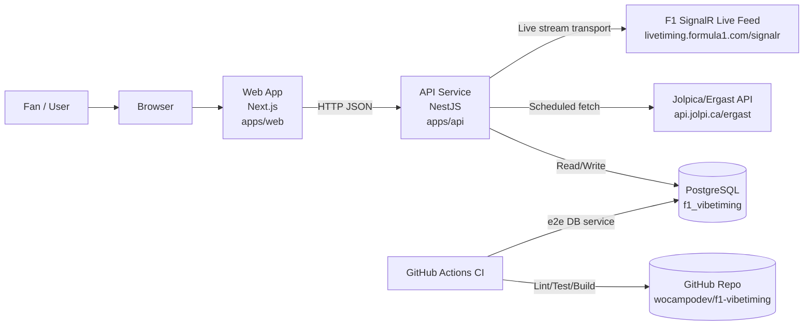

# 01. System Context

This diagram shows the external systems and primary boundaries for current runtime.

Source of truth:

- `apps/api/src/app.module.ts`
- `apps/api/src/ingestion/ingestion.service.ts`
- `apps/web/src/lib/api.ts`
- `compose.yml`
- `.github/workflows/ci.yml`
