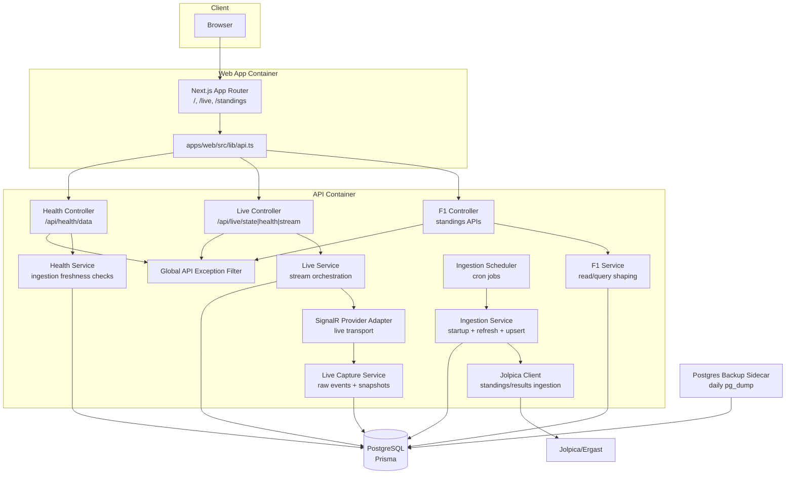

# 02. Container View

This diagram decomposes the runtime into deployable containers/services.

Source of truth:

- `apps/web/src/app/layout.tsx`
- `apps/web/src/lib/api.ts`
- `apps/api/src/f1/f1.controller.ts`
- `apps/api/src/f1/f1.service.ts`
- `apps/api/src/live/live.controller.ts`
- `apps/api/src/live/live.capture.service.ts`
- `apps/api/src/live/live.service.ts`
- `apps/api/src/ingestion/ingestion.scheduler.ts`
- `apps/api/src/ingestion/ingestion.service.ts`
- `apps/api/src/main.ts`
