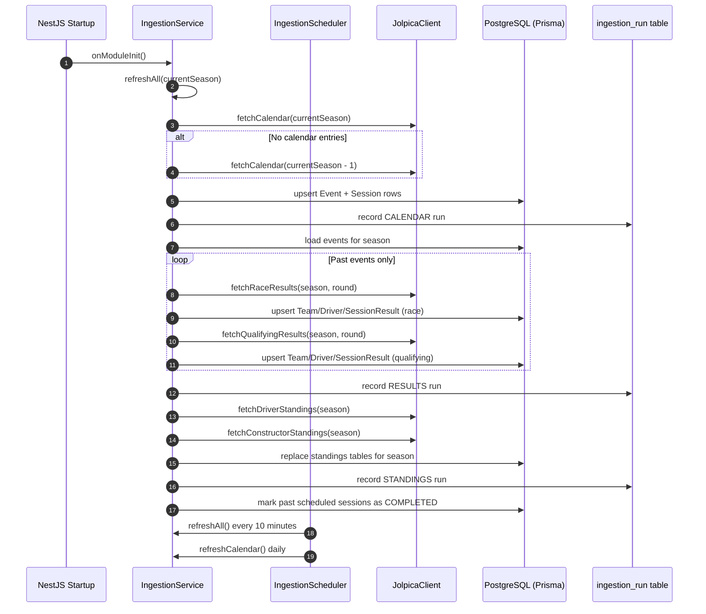

# 03. Ingestion Sequence

This diagram documents startup sync and scheduled refresh behavior.

Source of truth:

- `apps/api/src/ingestion/ingestion.service.ts`
- `apps/api/src/ingestion/ingestion.scheduler.ts`
- `apps/api/prisma/schema.prisma`
