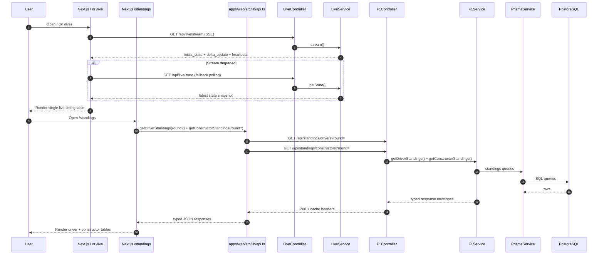

# 04. Request Flow

This diagram shows the current primary read-paths for the simplified product scope.

API contract notes:

- Live stream uses SSE envelopes (`initial_state`, `delta_update`, `heartbeat`, `status`).
- Standings responses include available rounds, previous-round references, movement deltas, and points-gap context fields.
- Errors follow a shared envelope (`error.code`, `error.message`, `error.details`).

Source of truth:

- `apps/web/src/components/live-dashboard.tsx`
- `apps/web/src/app/standings/page.tsx`
- `apps/web/src/lib/api.ts`
- `apps/api/src/live/live.controller.ts`
- `apps/api/src/live/live.service.ts`
- `apps/api/src/f1/f1.controller.ts`
- `apps/api/src/f1/f1.service.ts`
