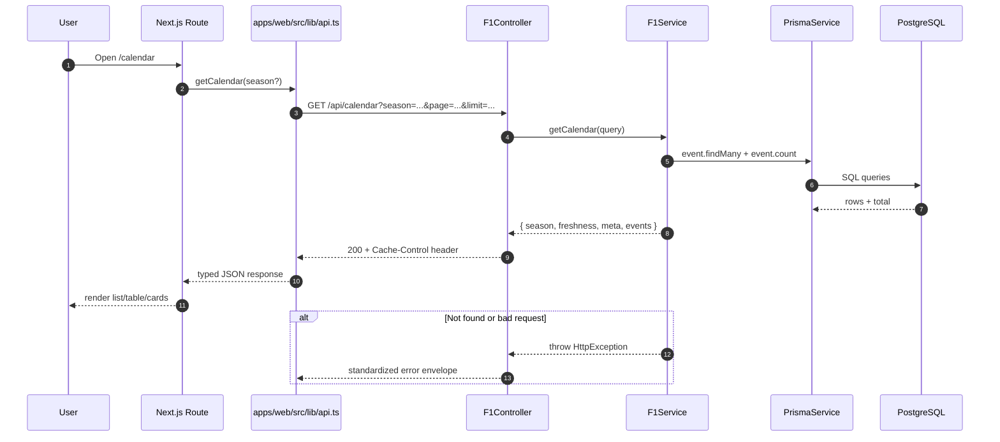

# 04. Request Flow

This diagram shows the read-path from web pages to API responses.

API contract notes (MVP):

- List endpoints include pagination metadata (`meta.page`, `meta.limit`, `meta.total`, `meta.totalPages`).
- Read endpoints set short cache headers.
- Errors follow a shared envelope (`error.code`, `error.message`, `error.details`).

Source of truth:

- `apps/web/src/lib/api.ts`
- `apps/api/src/f1/f1.controller.ts`
- `apps/api/src/f1/f1.service.ts`
- `apps/api/src/common/filters/api-exception.filter.ts`
