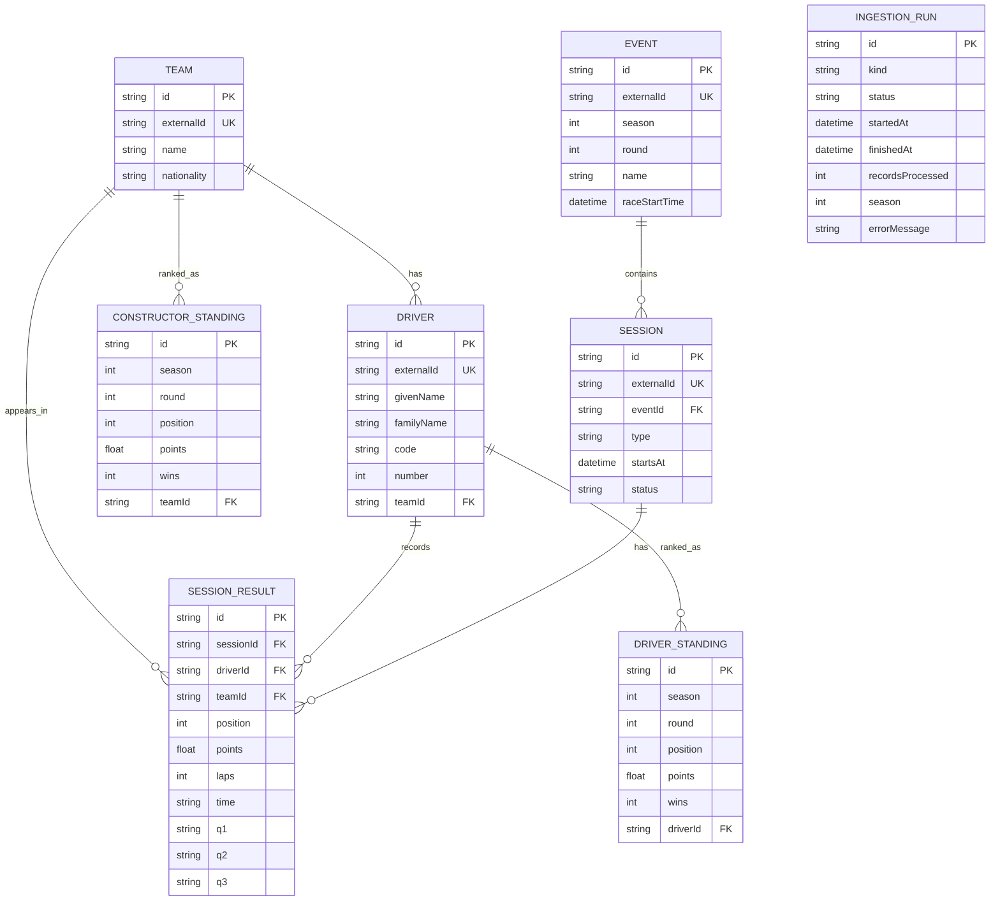

# 05. Data Model ERD

This ERD captures the current Prisma schema used by MVP ingestion and read APIs.

```mermaid
erDiagram
  TEAM ||--o{ DRIVER : has
  TEAM ||--o{ SESSION_RESULT : appears_in
  TEAM ||--o{ CONSTRUCTOR_STANDING : ranked_as

  DRIVER ||--o{ SESSION_RESULT : records
  DRIVER ||--o{ DRIVER_STANDING : ranked_as

  EVENT ||--o{ SESSION : contains
  SESSION ||--o{ SESSION_RESULT : has

  TEAM {
    string id PK
    string externalId UK
    string name
    string nationality
  }

  DRIVER {
    string id PK
    string externalId UK
    string givenName
    string familyName
    string code
    int number
    string teamId FK
  }

  EVENT {
    string id PK
    string externalId UK
    int season
    int round
    string name
    datetime raceStartTime
  }

  SESSION {
    string id PK
    string externalId UK
    string eventId FK
    string type
    datetime startsAt
    string status
  }

  SESSION_RESULT {
    string id PK
    string sessionId FK
    string driverId FK
    string teamId FK
    int position
    float points
    int laps
    string time
    string q1
    string q2
    string q3
  }

  DRIVER_STANDING {
    string id PK
    int season
    int round
    int position
    float points
    int wins
    string driverId FK
  }

  CONSTRUCTOR_STANDING {
    string id PK
    int season
    int round
    int position
    float points
    int wins
    string teamId FK
  }

  INGESTION_RUN {
    string id PK
    string kind
    string status
    datetime startedAt
    datetime finishedAt
    int recordsProcessed
    int season
    string errorMessage
  }
```

Source of truth:

- `apps/api/prisma/schema.prisma`
