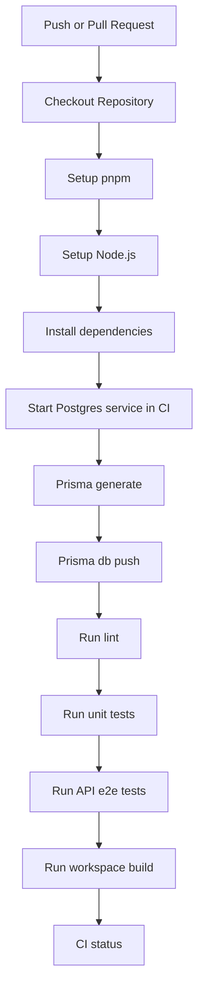

# 06. CI Flow

This diagram reflects the current GitHub Actions verification pipeline.

```mermaid
flowchart TD
  trigger[Push or Pull Request] --> checkout[Checkout Repository]
  checkout --> setupPnpm[Setup pnpm]
  setupPnpm --> setupNode[Setup Node.js]
  setupNode --> install[Install dependencies]

  install --> pg[Start Postgres service in CI]
  pg --> prismaGen[Prisma generate]
  prismaGen --> prismaPush[Prisma db push]

  prismaPush --> lint[Run lint]
  lint --> unit[Run unit tests]
  unit --> e2e[Run API e2e tests]
  e2e --> build[Run workspace build]
  build --> result[CI status]
```

Source of truth:

- `.github/workflows/ci.yml`
