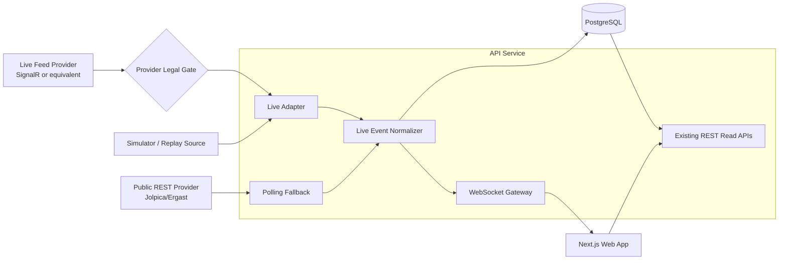

# 07. Live Mode Extension (Phase 2)

This is the target extension path without breaking current MVP contracts.

Delivery strategy for Phase 2:

- Build and validate the pipeline with a simulator/replay source first.
- Keep the live-provider adapter behind a legal/compliance gate.
- Enable real-provider production traffic only after legal sign-off.

Design guardrails:

- Keep current REST endpoints backward compatible.
- Keep provider adapter boundary explicit so sources can be swapped.
- Use fallback polling whenever live transport is unavailable.
- Treat legal/provider approval as a release gate for non-simulator live feeds.

Roadmap source:

- `AGENTS.md`
