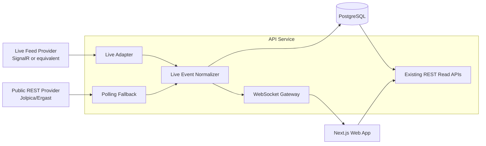

# 07. Live Mode Extension (Phase 2)

This is the target extension path without breaking current MVP contracts.

Design guardrails:

- Keep current REST endpoints backward compatible.
- Keep provider adapter boundary explicit so sources can be swapped.
- Use fallback polling whenever live transport is unavailable.

Roadmap source:

- `AGENTS.md`
