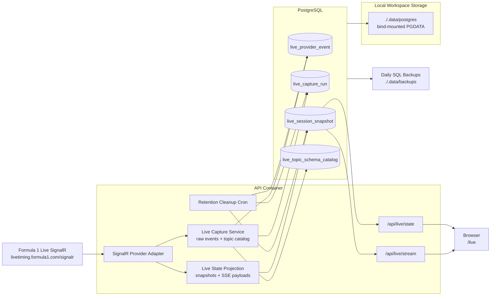

# 08. Live Provider Persistence

This diagram documents the local-first provider capture flow planned for live analysis.

Implementation notes:

- Raw provider messages are persisted after decode and before application-level projection.
- Normalized session snapshots are persisted separately so `/api/live/state` can recover from process restarts.
- Snapshot rows are append-only, versioned checkpoints keyed by session, with the latest row marked for fast restore.
- Each snapshot stores internal state, public state, projection metadata, and per-topic freshness metadata so `/api/live/board` and stabilized public ordering can recover more faithfully after restarts.
- Raw events and local SQL backups are both retained for 30 days in the local-only capture workflow.
- The bind-mounted Postgres datadir keeps captured data on disk even when containers are recreated.
- Topic schema catalog rows summarize observed payload shapes over time without exposing raw provider payloads to the web client.

Source of truth:

- `apps/api/src/live/live.provider.adapter.ts`
- `apps/api/src/live/live.capture.service.ts`
- `apps/api/src/live/live.capture.scheduler.ts`
- `apps/api/src/live/live.service.ts`
- `apps/api/prisma/schema.prisma`
- `compose.yml`
