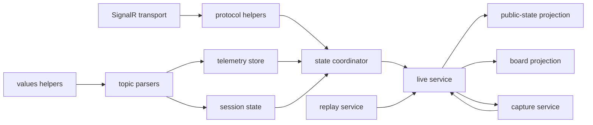

# 09. Live Runtime Internals

This note documents the current internal boundaries inside the NestJS live runtime.

## Responsibility map

- `live.provider.adapter.ts`: owns the provider connection lifecycle and publishes decoded provider events
- `live.provider.protocol.ts`: translates SignalR frames into decoded topic events
- `live.provider.values.ts`: keeps generic coercion/parsing primitives separate from provider-domain semantics
- `live.provider.topic-parsers.ts`: holds provider-specific semantics like sectors, tires, flags, and race-control parsing
- `live.provider.store.ts`: stores merged per-driver maps and builds draft leaderboard inputs
- `live.provider.session.ts`: stores session metadata, phase/flag, clock, and race-control state
- `live.provider.state.ts`: coordinates store + session state into a normalized `LiveState`
- `live.public-state.ts`: stabilizes or withholds public ordering when provider confidence is low
- `live.board.ts`: builds the richer `/api/live/board` contract for the web UI
- `live.capture.service.ts` and `live.replay.service.ts`: persistence, restore, replay, and audit workflows

## Naming conventions

- use `provider` in filenames when the code depends on Formula 1 provider semantics
- use `values` for generic parsing primitives that are reusable across multiple provider helpers
- use `topic-parsers` for helpers that understand a provider topic shape or domain meaning
- use `store` for mutable merged maps that accumulate topic patches over time
- use `session` for metadata that applies to the whole session rather than a single driver row
- use `state` for the coordinator that emits the canonical `LiveState`
- use `public-state` and `board` only for downstream projections from normalized internal state

## Source of truth

- `apps/api/src/live/README.md`
- `apps/api/src/live/live.service.ts`
- `apps/api/src/live/live.provider.adapter.ts`
- `apps/api/src/live/live.provider.state.ts`
- `apps/api/src/live/live.provider.store.ts`
- `apps/api/src/live/live.provider.session.ts`
- `apps/api/src/live/live.provider.leaderboard.ts`
- `apps/api/src/live/live.provider.parsers.ts`
